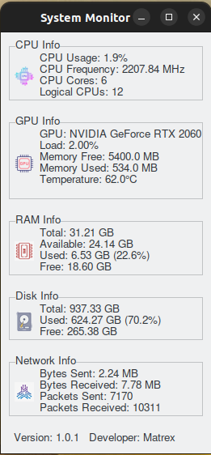

# System Monitor


## Overview

System Monitor is a graphical application to monitor your system's CPU, GPU, RAM, Disk, and Network usage. Built with Python and Tkinter, it provides a user-friendly interface to keep an eye on your system's performance in real-time.

## Features

- **CPU Monitoring**: Displays CPU usage, frequency, and core details.
- **GPU Monitoring**: Shows GPU load, memory usage, and temperature.
- **RAM Monitoring**: Monitors total, available, used, and free memory.
- **Disk Monitoring**: Displays disk usage statistics.
- **Network Monitoring**: Monitors network I/O statistics.
- **Modern UI**: Uses a modern theme for a clean and responsive interface.

## Screenshots



## Installation

### Prerequisites

Ensure you have Python 3 and the necessary dependencies installed. You can install the dependencies using the provided `requirements.txt` file.

```bash
pip install -r requirements.txt
sudo apt-get install python3-tk
```

### Building the Application

To build the application into a standalone executable, use PyInstaller with the provided `.spec` file.

```bash
pyinstaller system_monitor.spec
```

### Running the Application

After building the executable, you can run it directly.

```bash
./dist/system_monitor
```

## Development

### Setting Up the Development Environment

1. Clone the repository.
   ```bash
   git clone https://github.com/yourusername/system_monitor.git
   cd system_monitor
   ```

2. Create a virtual environment and activate it.
   ```bash
   python3 -m venv .venv
   source .venv/bin/activate
   ```

3. Install the dependencies.
   ```bash
   pip install -r requirements.txt
   ```

### Project Structure

```
systemMonitor/
│
├── icons/                      # Icons for the UI
│   ├── cpu.png
│   ├── disk.png
│   ├── gpu.png
│   ├── info.png
│   ├── main_window.png
│   ├── network.png
│   └── ram.png
│
├── build/                      # PyInstaller build directory
├── dist/                       # PyInstaller distribution directory
├── .idea/                      # PyCharm project files
├── .venv/                      # Virtual environment
├── __pycache__/                # Python cache files
│
├── system_monitor.py           # Main application script
├── system_monitor.spec         # PyInstaller spec file
├── requirements.txt            # Python dependencies
├── README.md                   # Project README file
└── LICENSE                     # License file
```

### Running the Application for Development

You can run the application directly from the source code for development purposes.

```bash
python system_monitor.py
```

## Contributing

Contributions are welcome! Please open an issue or submit a pull request for any improvements or bug fixes.

## License

This project is licensed under the MIT License. See the [LICENSE](LICENSE) file for details.

## Contact

For any questions or inquiries, please contact Muaaz Bdear at mouaz-11@hotmail.com.

